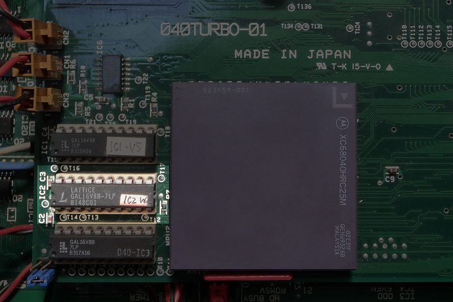

# 040GAL.LZH
BEEPs氏が開発されたX68030用の68040アクセラレータ、040turboのGALデータです。  
本GALデータでは『いわゆる040turbo本』が発行された後に判明した、1件の不具合を修正しています。  

## 本修正の対象となるGAL
IC2(GAL16V8)のみです。  
  

## 修正の内容
BERR信号が入力される複数の処理において、信号アサートのタイミングやGALチップの差異で  
いずれかの論理がバスエラーとして認識せず齟齬が発生し、68040はハングアップします。  
こうなるとNMIは効かず、リセットをするしかありません。  

この修正では、BERR信号をまとめて認識してからそれぞれの処理へ渡すように変更されています。  
修正内容の詳細は、参考として添付するIC2_V5.PLDと見比べてください。

事象を確認する手法に、バスエラーの一種であるスプリアス割り込みを頻発させる方法があります。  
当該事象は、スプリアス割り込みを意図的に頻発させる*mfptest*により発見されています。  

## 書き換えなくても大丈夫？
当時も、GALのロットで不具合の出る出ない（出にくい？）の違いがありました。  
対策前の古いGALデータでも*mfptest*でハングアップしなければ急いで書き直す必要はありませんが、  
動作環境や経年でどうなるか分かりませんので、本件を頭の片隅に留めておきましょう。  
ADPCMを含む音楽データ再生時、謎のハングアップをしている環境であれば改善される可能性があります。  

## 当時のアップロードヘッダ
	========================================================================
	《名    称》 040turboに使用されているGALデータ一式
	《登 録 名》 040GAL.LZH
	《日    付》 94/09/19 23:50:12
	《原 作 者》 BEEPs (PEG00631)
	《作    者》 BEEPs (PEG00631)
	《掲 載 者》 BEEPs (PEG00631)
	《著 作 権》 放棄
	《展開方法》 ISH 040GAL.ISH || LHA x 040GAL.LZH
	《転    載》 制限なし
	========================================================================
	《備    考》
	
	040turbo用に使われているGALデータの1994/9/20 現在における最新版です。
	
	以下のファイルが含まれています。
	
		IC1_V5             PLD       2991  94-09-19  23:46:58
		IC2_V6             PLD       2039  94-09-19  23:46:58
		IC3                PLD       2549  94-09-19  23:46:58
		IC4_V3             PLD       2773  94-09-19  23:46:58
		IC5                PLD       2095  94-09-19  23:46:58
		IC1_V5             JED       1446  94-09-19  23:46:58
		IC2_V6             JED       1488  94-09-19  23:46:58
		IC3                JED       1568  94-09-19  23:46:58
		IC4_V3             JED       2623  94-09-19  23:46:58
		IC5                JED       1694  94-09-19  23:46:58
	
	----------------------------------------------------------------------
	      040turboの情報はフリーです。転載、２次活用、その他自由です
	----------------------------------------------------------------------

#### 余談
動作速度の遅いバージョン（15と25）ならびにAtmel ATF16V8B-15では、古いGALデータ（V5）での  
ハングアップを確認できていません。  
当時はLatticeのロゴが***6つの正方形とL***で構成される比較的新しいロットが発生しやすかったような……  
